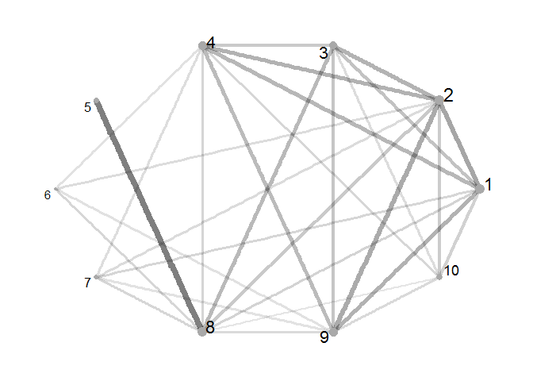

<!-- README.md is generated from README.Rmd. Please edit that file -->
`sowan2net` : Inference on Network Edge Weights from Sums of Weights At the Nodes

About
-----

The purpose of this package is to find weighted adjacency matrices of a graph or network that match data on the sums of the weights at each node. Since this is an underdetermined problem, the main function of the package is built to explore the solution space.

For a more detailed description of the problem, run `vignette("sowan2net")`.

Installation
------------

``` r
if (!require(devtools)) {
    install.packages('devtools')
}
devtools::install_github('miguelbiron/sowan2net')
```

Example
-------

We will apply the inference procedure to a random network. We start by defining some useful functions

``` r
# function for generating random weighted adjacency matrix
rand_wam = function(n, s = 0.5){
  # arguments:
  #     - n: number of nodes
  #     - s: sparsity parameter (probability of edge being equal to zero)
  
  m = as.integer(0.5*n*(n-1))
  M_vec = rexp(m)
  M_vec = M_vec * (runif(m) > s) # switch off some edges
  M = sowan2net::vec_2_sym_mat(M_vec)
  M = M / sum(M) # normalize weights
  return(M)
}

# plot a weighted adjacency matrix
plot_network = function(M, layout = "circle"){
  
  # format results
  rownames(M) = 1:nrow(M)
  colnames(M) = rownames(M)
  
  # plot recovered network
  ig_recover = graph.adjacency(round(M, 4), mode="undirected", weighted=TRUE)
  V(ig_recover)$col_sum = colSums(M)
  p = ggraph(ig_recover, layout = layout) +
    geom_edge_link(aes(alpha = weight, edge_width = weight), show.legend = FALSE) +
    geom_node_point(aes(size = col_sum), colour = "darkgray", show.legend = FALSE) +
    geom_node_text(aes(label = name, size = sqrt(col_sum)), repel = TRUE, show.legend = FALSE) +
    scale_edge_alpha_continuous(range = c(0.1, 0.5)) +
    scale_edge_width_continuous(range = c(1, 3)) +
    theme_graph()
  
  return(p)
  
}
```

Next, we sample a network and create a `node_data` data frame. For simplicity, we assume *T* = 1.

``` r
set.seed(1313)
n = 10
tru_mat = rand_wam(n, s = 0.5)

# node_data
node_data = tibble::tibble(
  time_id = rep(1, n),
  node_id = 1:n,
  S_vec   = colSums(tru_mat)
)
```

We can also plot this network. Note that the plot function makes the size nodes proportional to their sums of weights. Also, edges are proportional to their magnitude.

``` r
plot_network(tru_mat)
```


Now, we proceed to run the inference procedure on the data 200 times.

``` r
n_samples = 200
fit = sowan_2_net(
  node_data = node_data,
  n_samples = n_samples
)
```

We can inspect the results. Columns 2, 3 and 4 help diagnose the quality of the solution. When `status = 4`, we know that `nloptr` converged correctly. Additionally, we want the error (squared difference between the given sums of weights and the node sums of the inferred networks) to be as low as possible, and the sum of the components of the matrix equal to 1

``` r
print(fit)
```

    ## # A tibble: 200 x 5
    ##    index status        error    sum_M               M
    ##    <int>  <int>        <dbl>    <dbl>          <list>
    ##  1     1      4 9.626759e-23 1.000000 <dbl [10 x 10]>
    ##  2     2      4 1.741081e-13 1.000001 <dbl [10 x 10]>
    ##  3     3      4 1.889021e-23 1.000000 <dbl [10 x 10]>
    ##  4     4      4 1.179090e-15 1.000000 <dbl [10 x 10]>
    ##  5     5      4 2.133505e-12 1.000002 <dbl [10 x 10]>
    ##  6     6      4 3.456350e-20 1.000000 <dbl [10 x 10]>
    ##  7     7      4 1.156206e-18 1.000000 <dbl [10 x 10]>
    ##  8     8      4 7.132773e-23 1.000000 <dbl [10 x 10]>
    ##  9     9      4 5.186321e-12 1.000001 <dbl [10 x 10]>
    ## 10    10      4 1.056945e-13 1.000001 <dbl [10 x 10]>
    ## # ... with 190 more rows

Let us plot 2 of the inferred networks selected at random.

``` r
plot_list = lapply(fit[sample(1:n_samples, 2), "M"]$M, plot_network)
do.call("grid.arrange", plot_list)
```


An interesting way to classify the results is by their sparseness. Let us calculate the number of edges close to zero

``` r
fit = fit %>%
  mutate(x_eq_0 = unlist(lapply(M, function(m, eps){sum(m < eps)}, eps = 5e-5)))
```

Now, let us plot the networks with the highest number of edges close to zero.

``` r
indexes = which(max(fit$x_eq_0) == fit$x_eq_0)
plot_list = lapply(fit[indexes, "M"]$M, plot_network)
do.call("grid.arrange", plot_list)
```


And these are the densest networks

``` r
indexes = which(min(fit$x_eq_0) == fit$x_eq_0)
plot_list = lapply(fit[indexes, "M"]$M, plot_network)
do.call("grid.arrange", plot_list)
```



To Do
-----

-   Improve documentation
